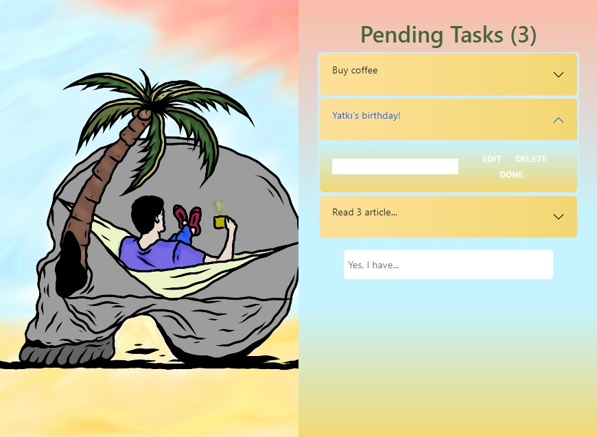

# React Advance To Do

## Live Link

## --->

> What I practiced?

- Passing data to components
- Used event handlers for add, remove, edit and for done
- Hooks, useState, useEffect
- Arrow functions
- Rendering list data with map

## Image

